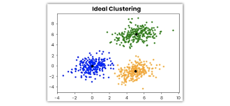

# My ML Practice

Welcome to my Machine Learning practice repository! Here, I share my complete ML practice notes, the resources I used to learn machine learning, and the tasks I completed during my learning journey.

## Table of Contents

- [Machine Learning](#machine-learning)
- [ML vs DL](#ml-vs-dl)
- [Conclusion](#conclusion)
- [Types of Machine Learning](#types-of-machine-learning)
- [References](#references)

## Machine Learning

Machine Learning is a field of Computer Science that gives computers the ability to learn without being explicitly programmed.

Machine learning is used to find patterns in existing data. These patterns can produce outputs for given inputs. With these patterns, we can predict outputs for new inputs.

### Example
Consider the task of summing numbers. Machine learning can learn from data and perform the sum every time you provide numbers—whether two, three, or many numbers. In contrast, if explicitly programmed, you would need to write separate logic for summing two numbers, three numbers, and so on.

## ML vs DL

### ML
ML writes the rules for itself with the given data. It uses statistical tools.

**Example**  
If you give a lot of images, some of which are dogs and some are not, the machine writes the code rules itself to identify which is a dog.

### DL
Inspired by the human brain, we train a model to learn the data, similar to machine learning, but here we use nodes and layers. If the layers increase, the accuracy of the model increases.

### Conclusion

(Explicit programming (only suits for the particular scenario)) > (ML (can learn with data (features and target) on its own and work with different scenarios)) > (DL (creates features by its own to find the target))

## Types of Machine Learning

### 1. Supervised Learning
Generally, supervised machine learning works to find the relationship between input and the output. With that, we can find the pattern for new input.

- **Regression**
  - Numerical data
  - **Example**
    - House price prediction
    - Email spam detection
- **Classification**
  - Not numerical, just categorizing the data into groups based on its behavior
  - **Example**
    - Gender
    - Nation

### 2. Unsupervised Learning
In unsupervised learning, there is only the input.

- **Clustering**
  - Labeling the group of objects based on its behavior
  - **Example**
    - Customer segmentation:
      - Customers who spend more and buy more products: label - big customer
      - Customers who spend more but buy less products: label - small customer
      - Customers who spend less and buy less products: label - regular customer
  - 
- **Dimensionality Reduction**
  - Reduce the columns in the input. If there are two or more columns in the input, it can combine them into one to make the algorithm easier.
  - **Example**
    - House price prediction with two inputs: number of "bedrooms" and "washrooms" converted into a single column "square feet"
- **Anomaly Detection**
  - Finds the outlier data
- **Association Rule Learning**
  - Used to find the correlation between data
  - **Example**
    - While scanning hundreds of bills in a supermarket, finding that 60% of customers buy eggs while buying milk

### 3. Semi-Supervised Learning
Can work with few labeled data. By that data, it can label other data itself.

### 4. Reinforcement Learning
The algorithm can improve itself over time with the help of feedback.

## References

- [Machine Learning Playlist](https://youtu.be/ZftI2fEz0Fw?list=PLKnIA16_Rmvbr7zKYQuBfsVkjoLcJgxHH)

